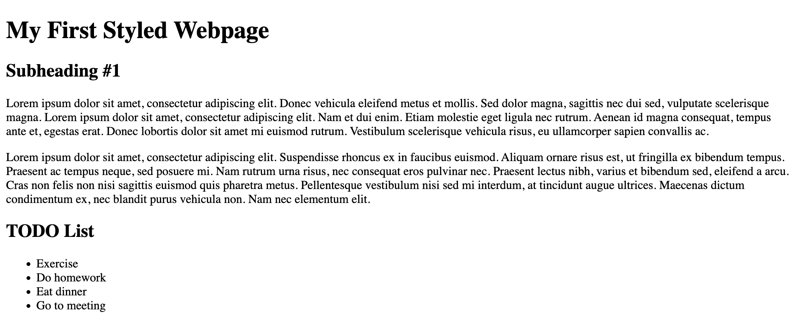
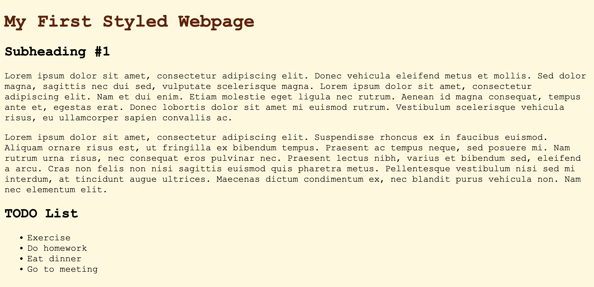
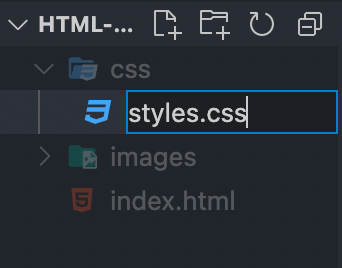
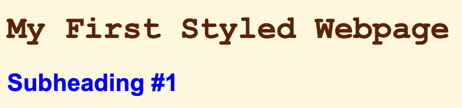

## Introduction to CSS

CSS (Cascading Style Sheets) describes how the HTML documented is presented by making the webpage more appealing through the control of layouts, fonts, colors, and more!

## Applying CSS

We'll use this example below:
```html
<!DOCTYPE html>
<html> 
    <body>
        <h1>My First Styled Webpage</h1>
        <h2>Subheading #1</h2>
        <p>
            Lorem ipsum dolor sit amet, consectetur adipiscing elit. Donec vehicula eleifend metus et mollis. Sed dolor magna, sagittis nec dui sed, vulputate scelerisque magna. Lorem ipsum dolor sit amet, consectetur adipiscing elit. Nam et dui enim. Etiam molestie eget ligula nec rutrum. Aenean id magna consequat, tempus ante et, egestas erat. Donec lobortis dolor sit amet mi euismod rutrum. Vestibulum scelerisque vehicula risus, eu ullamcorper sapien convallis ac.
        </p>
        <p>
            Lorem ipsum dolor sit amet, consectetur adipiscing elit. Suspendisse rhoncus ex in faucibus euismod. Aliquam ornare risus est, ut fringilla ex bibendum tempus. Praesent ac tempus neque, sed posuere mi. Nam rutrum urna risus, nec consequat eros pulvinar nec. Praesent lectus nibh, varius et bibendum sed, eleifend a arcu. Cras non felis non nisi sagittis euismod quis pharetra metus. Pellentesque vestibulum nisi sed mi interdum, at tincidunt augue ultrices. Maecenas dictum condimentum ex, nec blandit purus vehicula non. Nam nec elementum elit.
        </p>
        <h2>TODO List</h2>
        <ul>
            <li>Exercise</li>
            <li>Do homework</li>
            <li>Eat dinner</li>
            <li>Go to meeting</li>
        </ul>
    </body>
</html>
```



### Internal Style

Add the elements within the `<head>` element
```html
<!DOCTYPE html>
<head>
    <html> 
         <!-- COPY HERE -->
        <head> <!-- Used to specify metadata for the webpage -->
            <style>
                body {
                    font-family: 'Courier New', Courier, monospace;
                    background-color: cornsilk;
                }
                h1 {
                    color: rgb(100, 30, 0);
                }
            </style>
        </head>
        <!-- END HERE -->
        <body>
            <h1>My First Styled Webpage</h1>
            ...
        </body>
    </html> 
</head>
```


Now let's examine how these styles are applied. All styles are defined in the `<style>` tag. 

```html
<style>

/* "body" is selector */
body {
    font-family: 'Courier New', Courier, monospace; /* Declatation */
    background-color: cornsilk; /* Declatation */
}

/* "h1" is selector */
h1 {
    color: rgb(100, 30, 0); /* Declatation */
}
</style>
```

A selector indicates which elements are styled, which in this example is `body` and `h1`. A declaration indicates how the elements are styled and requires two parts: a property and value. These two parts are separated by colon. At the end of each declaration, we need to include a semi-colon.

Observe the `font-family` declaration. After the colon, it lists three fonts in the order it should fallback to, starting with Courier New, then a generic Courier front, then to a generic monospace font. As a result, all elements in the `<body>` element will be applied with one of the listed fonts. 

Next, observe the `background-color` and `color` declaration. Both of these properties require a color. It can be a named color such as `cornsilk` or `blue`, or an rgb value such as `rgb(100, 30, 0)` or `rgb(127, 127, 127)`. 


### External Style

Imagine if our webpage was much larger or you had another pages that used a similar theme. Not only would it our HTML code more messy, but also more difficult to organize. You would need to copy and paste your internal style to all of your HTML files and make changes to each file whenever you change your theme. How can we improve our organization?

We can modularize our style by separating our CSS into another file and then link our HTML and CSS code.

Create a new folder called `css`. In the folder, create a file named `styles.css`. 




Then in `styles.css`, paste the following CSS code:

```css
body {
    font-family: 'Courier New', Courier, monospace;
    background-color: cornsilk;
}
h1 {
    color: rgb(100, 30, 0);
}
```

Finally, to link our HTML code to `styles.css`, modify `index.html` to include the `<link>` element:

```html
<!DOCTYPE html>
<head>
    <html> 
        <head>
            <link rel="stylesheet" href="css/styles.css">
        </head>
        <body>
            <h1 style="color:red; font-size:20px;">My First Styled Webpage</h1>
            ...
        </body>
    </html> 
</head>
```

Our website shouldn't look any different from our previous design! We have successfully modularized our CSS code to be cleaner and reusable.

### Inline Style

In our HTML code, we can also directly modify the style for a specific element. For example, update the subheading to the following.

```html
<h2 style="color: blue; font-family: Arial, Helvetica, sans-serif;">Subheading #1</h2>
```



> It's important to note which style type has a higher priority in terms of which styles are applied.
>
>1. Inline Style
>2. Internal Style
>3. External Style
>
> Also, the more specific selector will be applied in the case of conflicting style. For example, if `<body>` sets the color text to blue and `<h2>`, which is located in `<body>` sets the color to yellow. This is because the styles of `<h2>` will have priority over `<body>`.

### Ending Code

`index.html`
```html
<!DOCTYPE html>
<head>
    <html> 
        <head> 
            <link rel="stylesheet" href="css/styles.css">
        </head>
        <body>
            <h1>My First Styled Webpage</h1>
            <h2 style="color: blue; font-family: Arial, Helvetica, sans-serif;">Subheading #1</h2>
            <p>
                Lorem ipsum dolor sit amet, consectetur adipiscing elit. Donec vehicula eleifend metus et mollis. Sed dolor magna, sagittis nec dui sed, vulputate scelerisque magna. Lorem ipsum dolor sit amet, consectetur adipiscing elit. Nam et dui enim. Etiam molestie eget ligula nec rutrum. Aenean id magna consequat, tempus ante et, egestas erat. Donec lobortis dolor sit amet mi euismod rutrum. Vestibulum scelerisque vehicula risus, eu ullamcorper sapien convallis ac.
            </p>
            <p>
                Lorem ipsum dolor sit amet, consectetur adipiscing elit. Suspendisse rhoncus ex in faucibus euismod. Aliquam ornare risus est, ut fringilla ex bibendum tempus. Praesent ac tempus neque, sed posuere mi. Nam rutrum urna risus, nec consequat eros pulvinar nec. Praesent lectus nibh, varius et bibendum sed, eleifend a arcu. Cras non felis non nisi sagittis euismod quis pharetra metus. Pellentesque vestibulum nisi sed mi interdum, at tincidunt augue ultrices. Maecenas dictum condimentum ex, nec blandit purus vehicula non. Nam nec elementum elit.
            </p>
            <h2>TODO List</h2>
            <ul>
                <li>Exercise</li>
                <li>Do homework</li>
                <li>Eat dinner</li>
                <li>Go to meeting</li>
            </ul>
        </body>
    </html> 
</head>
```

`styles.css`
```css
body {
    font-family: 'Courier New', Courier, monospace;
    background-color: cornsilk;
}
h1 {
    color: rgb(100, 30, 0);
}
```


