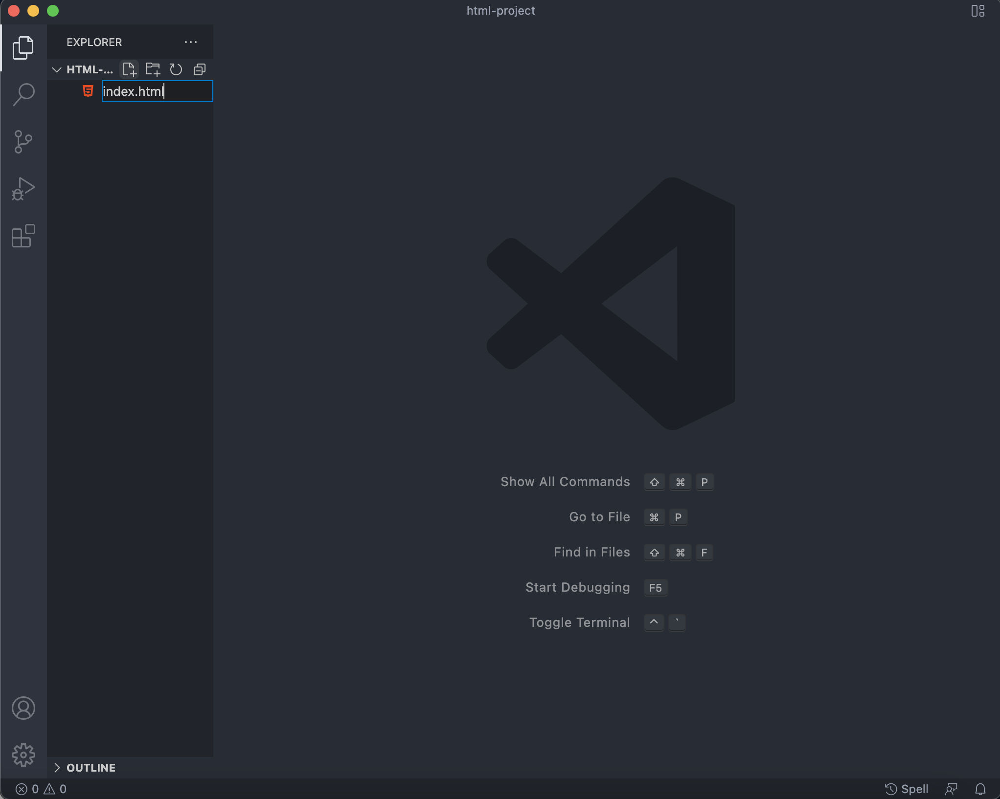
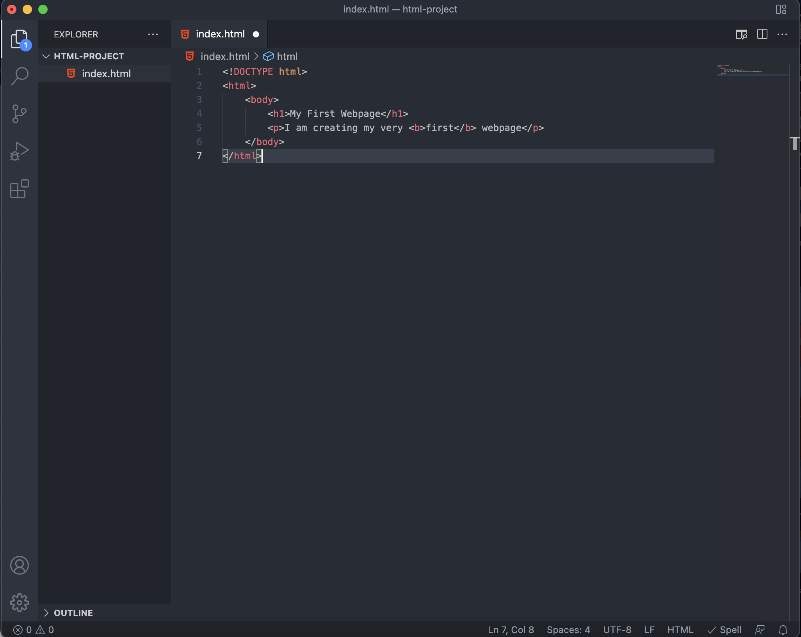
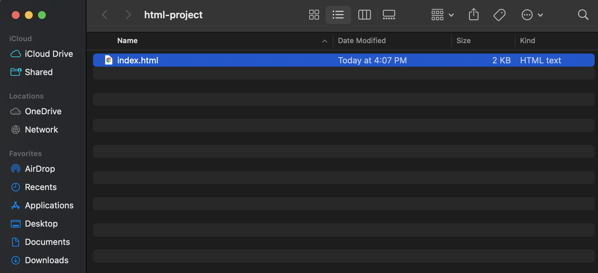
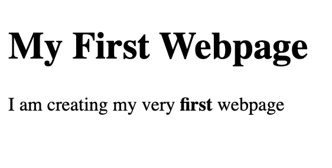

## Learning Objectives 

- Understand what is HTML
- How to create and render an HTML page on your browser

HTML (HyperText Markup Language) is a markup language that the web browser can render. 


```html
<html>
    <body>
        <h1>Main Heading</h1>
        <p>This body of text represents a paragraph</p>
        <h2>Here's a sub-heading</h2>
        <p>Here's the paragraph for the sub-heading</p>
    </body>
</html>
```

Each line within `<body>` represents an HTML element. Each HTML element contains an opening tag, some content, and an ending tag. Take `<h1>Main Heading</h1>` for example. The opening tag is `<h1>`, the content is **Main Heading**, and the closing tag is `</h1>` (Observe the extra forward slash).

## Creating Your First Webpage

You'll need a text editor to create your first webpage. If you are on Windows or Mac, I personally recommend installing an editor such as [Visual Studio Code](https://code.visualstudio.com/). Otherwise, you can use Notepad **(Windows)** or TextEdit **(Mac)** as your text editor.

Create a new `.html` file named `index.html`.



Then in your `.html` file, copy or type the following code.

```html
<!DOCTYPE html>
<html> 
    <body>
        <h1>My First Webpage</h1>
        <p>I am creating my very <b>first</b> webpage</p>
    </body>
</html>
```




All HTML documents must include `<!DOCTYPE html>` at the very top to tell the browser it should render an HTML document. According to the HTML specification, this is necessary to ensure your web page is rendered correctly.

- The `<html>` element serves as a container for all other elements.

- The `<body>` element contains all content that the user can see on the page.

- The `<b>` element bolds all words it surrounds

Take note of the nested structure of the HTML code. Each element is nested within another element through a tab indent. Also notice how `<b>` is not indented. This is because `<b>` is considered an inline element, meaning that you treat them like text/content.


## Opening Your Webpage

Save your file using **CTRL-S** or **File** -> **Save**. Then in your file explorer, double-click on your `.html` and your browser will render your web page like so!






